# Sosteto

**Sosteto** is a platform designed to connect nurses with recruiters, facilitating job placements and enhancing career opportunities in the healthcare sector. This project utilizes a design thinking approach, focusing on user needs and experience throughout the development process.

## Table of Contents

- [Features](#features)
- [Technologies Used](#technologies-used)
- [Installation](#installation)
- [Screenshots](#screenshots)

## Features

- **User Registration**: Allows nurses and recruiters to create accounts easily.
- **Job Listings**: Nurses can browse job opportunities tailored to their skills and preferences.
- **Profile Management**: Users can update their profiles with relevant information and experiences.
- **Application Process**: Nurses can apply for jobs directly through the platform.
- **Back Office Management**: A web-based back office for recruiters to manage job listings, view applications, and communicate with nurses.

## Technologies Used

- **Frontend**: React Native
- **Backend**: Node.js, REST API
- **Database**: MongoDB
- **Back Office**: React.js
- **Documentation**: Swagger
- **Testing**: JTest, Postman
- **Design Tools**: Miro, UML

## Installation

To get a local copy up and running, follow these steps:

1. **Clone the repository**:
   ```bash
   git clone https://github.com/yourusername/sosteto.git

## Screenshots

### Mobile App
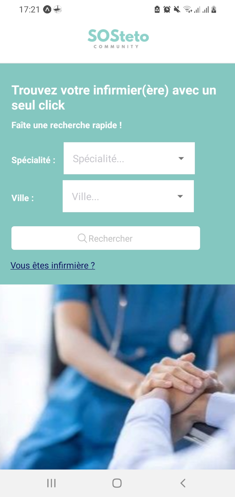
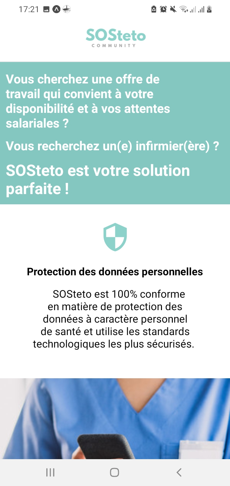
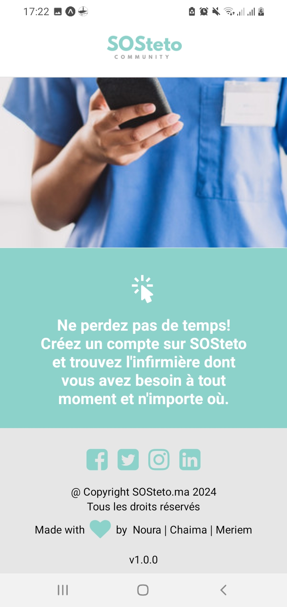
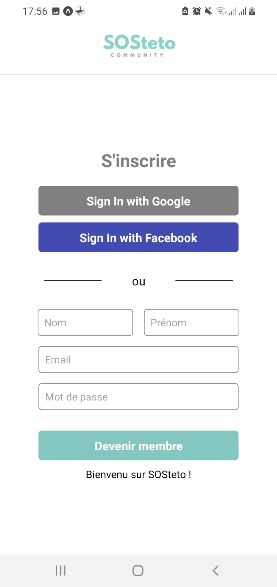
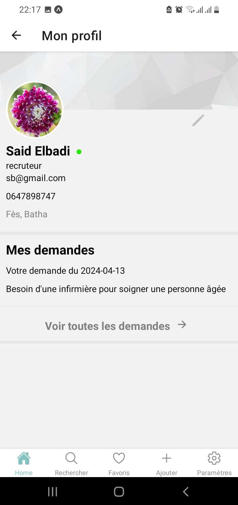
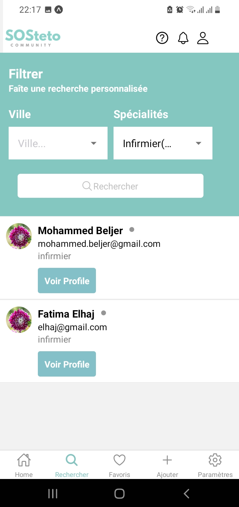
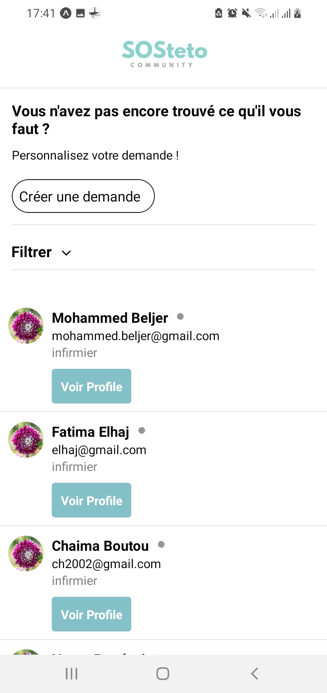
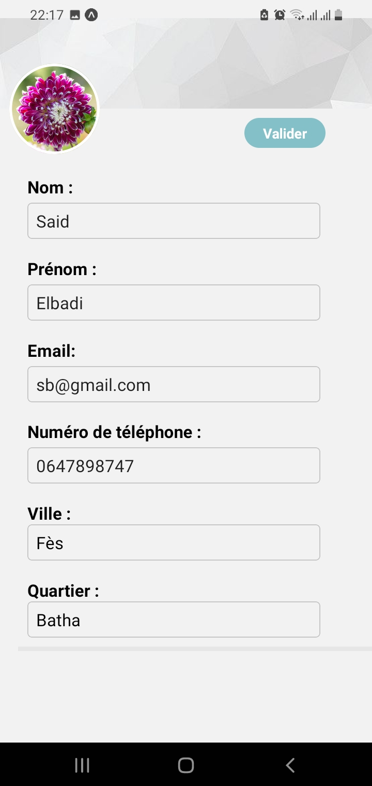
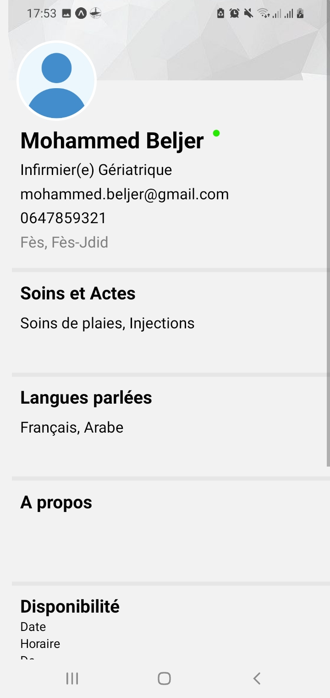
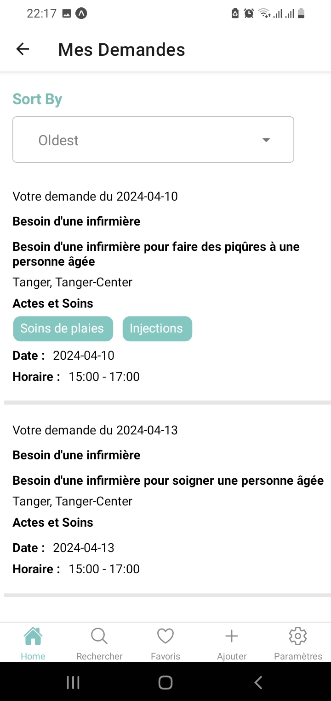
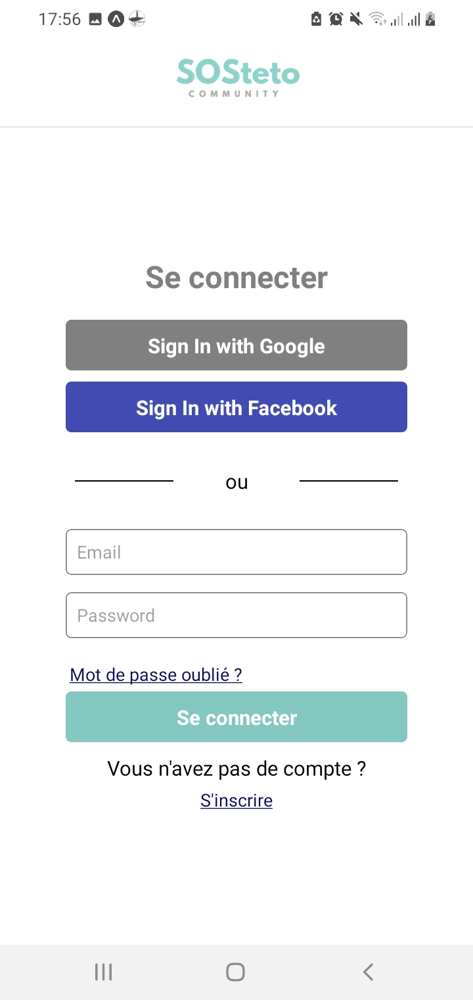
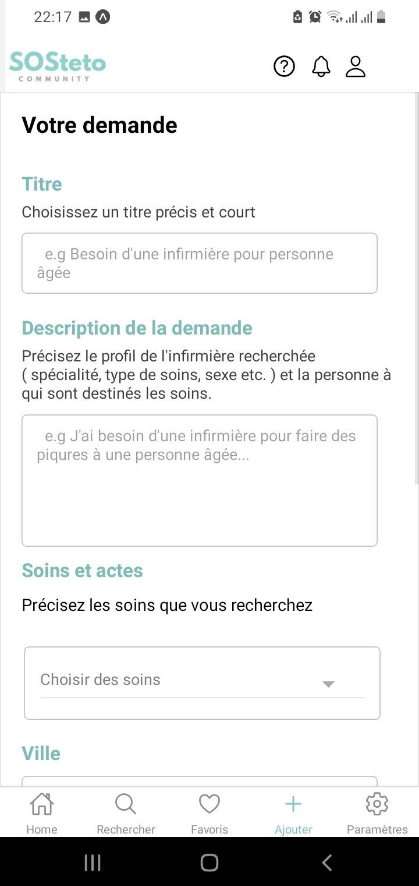
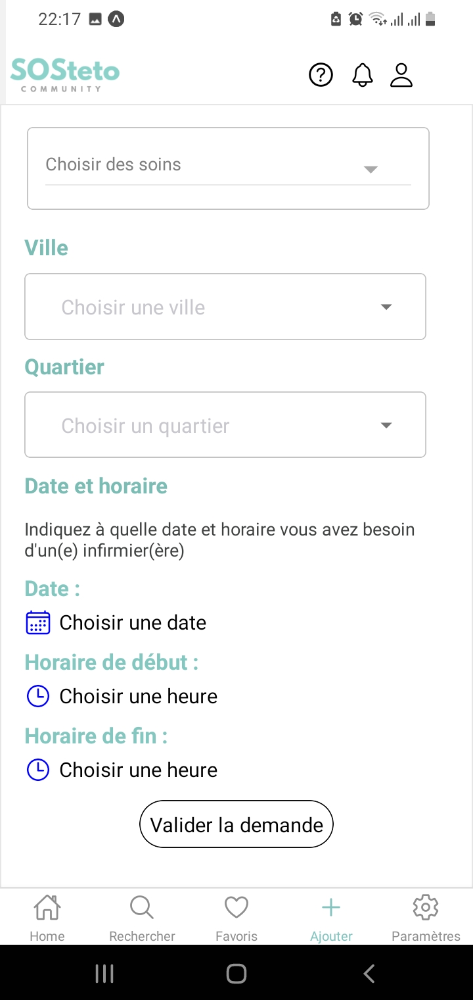

### Back Office
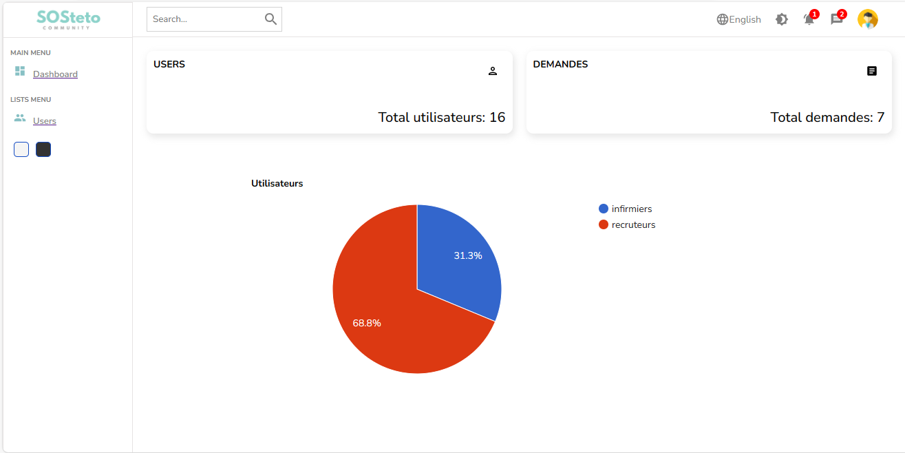
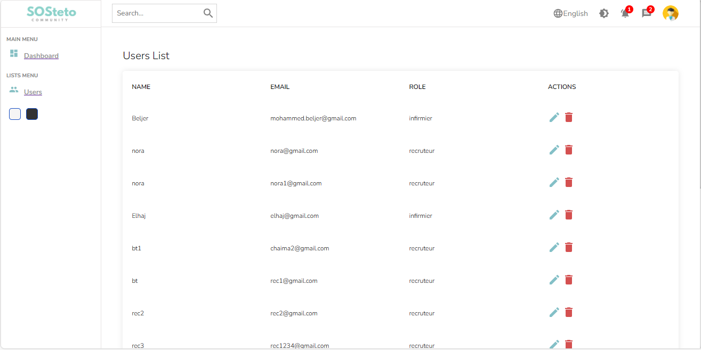
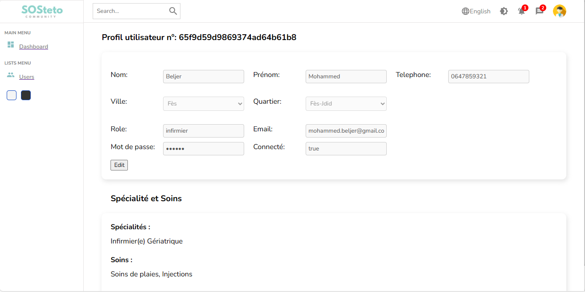
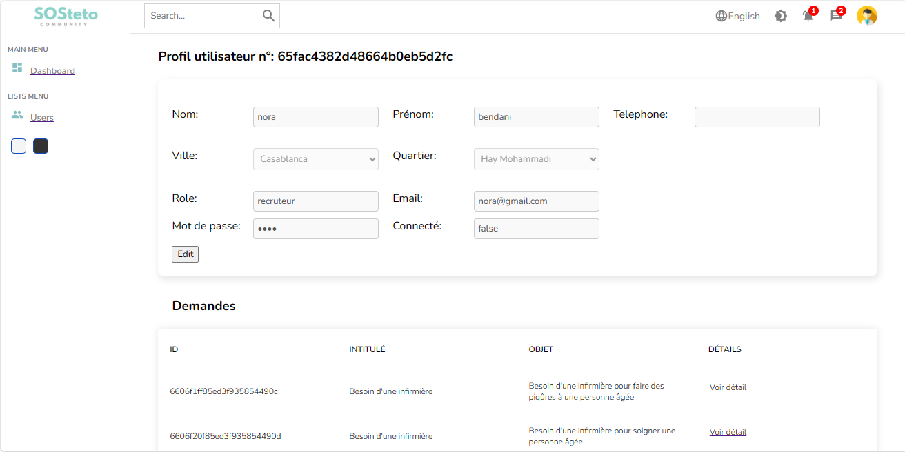
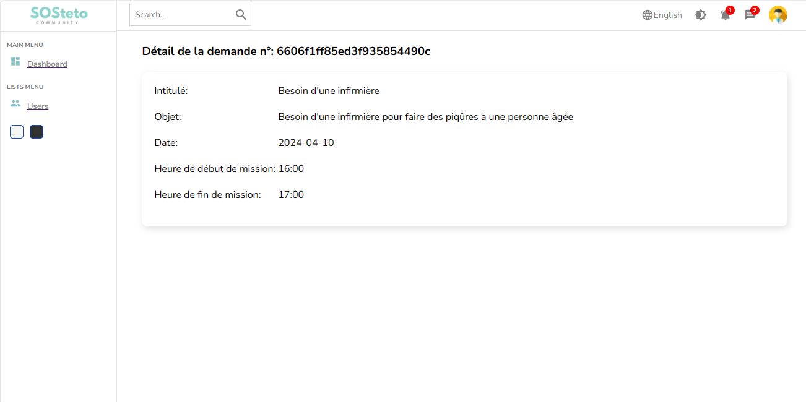
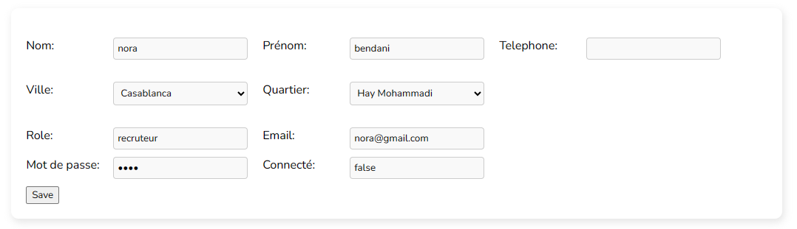
